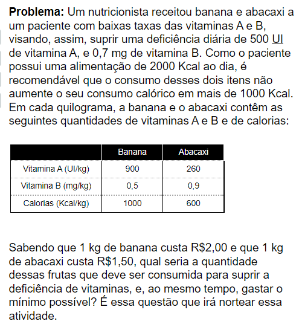

# Anotações - Experimento 2 - Matemática Básica
Atividade referente a disciplina de matemática básica. 
Site de referência: [Como montar sua dieta?](https://m3.ime.unicamp.br/arquivos/software/1224/atividade1_parte1.html) 



- Paciente necessita
  - Vitamina A: **500 UI**
  - Vitamina B: **0,7 mg**
  - Calorias de banana / abacaxi < **1000 Kcal.**
- 1 kg de banana custa R$2,00 e que 1 kg de abacaxi custa R$1,50

## Questão 1.1 (Latex)
```
\frac{1000}{100} = \frac{2}{x}\\
1000 * x = 200\\
x = \frac{200}{1000} = \frac{2}{10}\\
x = \text{0,2 reais}\\\\

\frac{1000}{100} = \frac{1.5}{y}\\
1000 * x = 150\\
y = \frac{150}{1000} = \frac{15}{100}\\
y = \text{0,15 reais}\\\\

x + y = 0.2 + 0.15 = \text{0.35 reais}
```

## Questão 1.2 (Latex)
```
\frac{1000}{400} = \frac{2}{x}\\
1000 * x = 800\\
x = \frac{800}{1000} = \frac{8}{10}\\
x = \text{0,8 reais}\\\\

\frac{1000}{800} = \frac{1.5}{y}\\
1000 * x = 1200\\
y = \frac{1200}{1000} = \frac{12}{10}\\
y = \text{1,2 reais}\\\\

x + y = 0.8 + 1.2 = \text{2 reais}
```

## Questão 2
Definido ponto **1 kg de Abacaxi** e **0,3 kg de Banana**