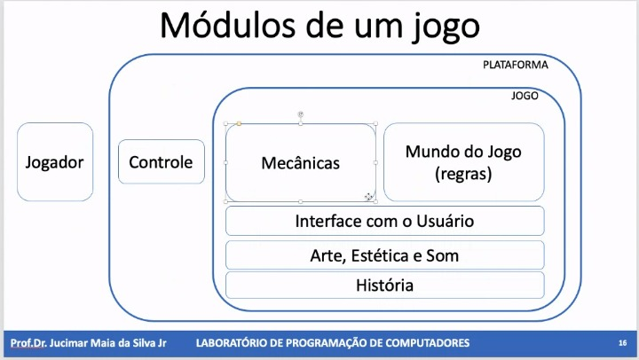

# Montando um Game

## Estrutura de um jogo

- **Head-Up Display(HUD)**: Informações que mostram o estado atual do jogo. Ex: barra de vida, barra de mana, pontuação, ...
- **Personagem**: Elemento controlado pelo jogador
- **Mecânica**: Interação do personagem com os elementos do jogo. Ex: Pontuar ao realizar x ação.
  - **Deve** ter um *feedback* visual ou sonoro.
- Todo jogo possui **regras** que determinam a vitória ou derrota de um jogador
- **Game Design**: Projeto das mecânicas do jogo.
- **Game Loop**:
  - Controle e Eventos
  - Mecânicas

> Importante a ``modularização`` das funcionalidades para melhor programação do jogo.