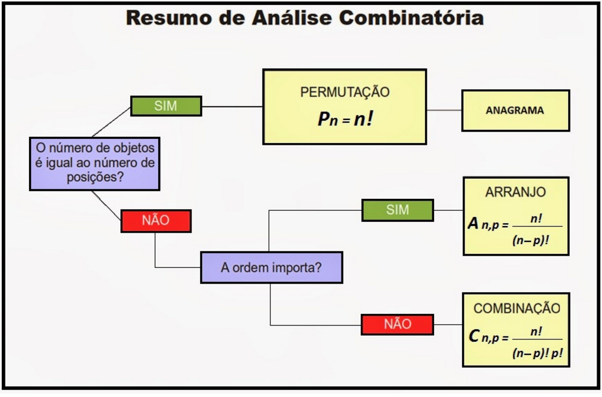

# Prova - 27/02/2023 - Algoritmos para geração combinatória de objetos

- Árvore de possibilidades

## Permutação

- Simples: Não há elementos repetidos
  Ex: Anagragrama com as letras de uma palavra formada por letras distintas, duas a duas.

Pn = n . n-1 . n-2 . ... . 3 . 2 . 1 = n!

- Com repetição: O número total de permutações é inferior àquele que se poderia fazer, caso todos os elementos fossem diferentes. Os elementos repetidos geram sequências idênticas, o que reduz o número total de possibilidades distintas.

P\[n1,n2,...,nk\](n) = n! / (n1! . n2! ... nk!)

## Combinação e Arranjo

Ao usar/escolher apenas uma parte dos elementos do conjunto, se faz combinação (sem ordem) ou arranjo (com ordem).

## Resumo

## Participação

- Ordenada e não-ordenada

P = (n!)/((n1!) . (n2!) . (nk!))
